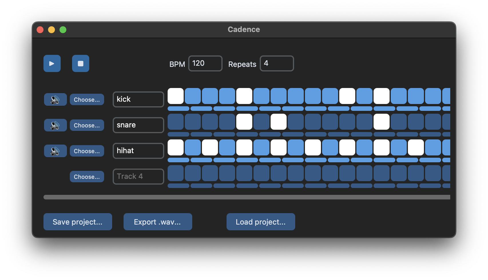

# Cadence



Cadence is a minimalist software music sequencer written in Python.

_[Lire en français](/README_fr.md)_

## Getting started

1. Clone the repo:

```bash
$ git clone https://github.com/emilykl/cadence.git
$ cd cadence
```

2. Install package:

```bash
$ pip install -e .
```

3. Play a sequence:
```bash
$ python sequences/seq1.py
```

4. Launch visual interface:
```bash
$ cadence go
```


## Usage

Cadence consists of a Python API, a command-line interface, and a visual user interface.

### Python API usage

See `sequences/seq1.py` for an example of how to use the Cadence Python API to play a sound sequence.

### Command-line interface

After installation, run

```bash
$ cadence --help
```

to see the available CLI commands.

### Visual interface

Run the command

```bash
$ cadence go
```

in your terminal to launch the visual interface.

## Saving and loading projects

A project can be saved in two ways:
- by calling the `cadence.save_project()` function (see example at the bottom of `sequences/seq1.py`)
- via the "Save project..." button in the UI

A saved project consists of a folder called `projectname.cadence/` with the following structure:

```
projectname.cadence/
 ├─ project.json      # metadata and sound timings
 └─ sounds/           # contains all sound files
    ├─ sound1.wav
    ├─ sound2.wav
    └─ ...
```

Once saved, a project can be loaded in three ways:
- by calling the `load_project()` function
- by running the command `cadence load projectname.cadence` to launch the project in the UI
- by clicking the "Load project..." button within the UI

## Sounds

The `sounds/` directory includes a set of built-in sound files to use in your projects. You can also use your own sound files, as long as they meet the following requirements:

- Sounds must be `.wav` files
- All sounds used in a single project must have the same sample rate, bit depth, and number of channels (mono or stereo).

The `ffmpeg` command line utility can be used for converting sound files to the correct format.
