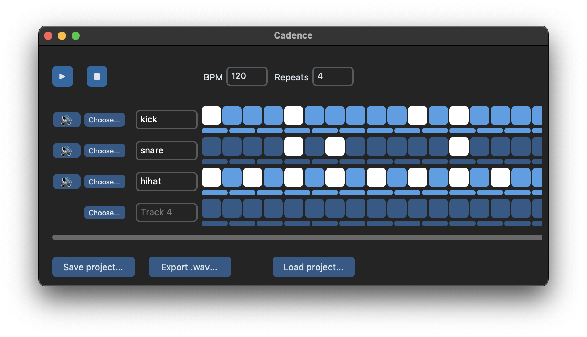

# Cadence
_[Read in English](/README.md)_



Cadence est un logiciel de séquençage musical minimaliste écrit en Python.

## Pour commencer

1. Cloner:

```bash
$ git clone https://github.com/emilykl/cadence.git
$ cd cadence
```

2. Installer le paquet:

```bash
pip install -e .
```

3. Jouer une séquence:
```bash
python sequences/seq1.py
```

4. Lancer l'interface visuelle:
```bash
$ cadence go
```

## Utilisation

Cadence consiste en une API Python, une interface en ligne de commande, et une interface utilisateur visuelle.

### Utilisation de l'API Python

Voir `sequences/seq1.py` pour un exemple de l'usage de l'API Python de Cadence pour jouer une séquence sonore.

### Interface en ligne de commande

Après l'installation, exécutez

```bash
$ cadence --help
```

pour voir les commandes disponibles.

### Interface visuelle

Exécutez la commande

```bash
$ cadence go
```

dans votre terminal pour lancer l'interface visuelle.

## Sauvegarder et charger des projets

Il existe deux façons de sauvgarder un projet:
- en appelant la fonction `cadence.save_project()` (exemple donné au bas du fichier `sequences/seq1.py`)
- en cliquant sur le bouton "Save project..." dans l'interface 

Le projet sauvegardé consiste en un dossier appelé `nomduprojet.cadence/` avec la structure suivante:

```
nomduprojet.cadence/
 ├─ project.json      # métadonnées et timings des sons
 └─ sounds/           # contient tous les fichiers sonores
    ├─ sound1.wav
    ├─ sound2.wav
    └─ ...
```

Une fois sauvegardé, un projet peut être chargé de trois façons:
- en appelant la fonction `load_project()`
- en exécutant la commande `cadence load nomduprojet.cadence` pour lancer le projet dans l'interface
- en cliquant sur le bouton "Load project..." dans l'interface

## Sons

Le dossier `sounds/` contient un ensemble de fichiers sonores à utiliser dans vos projets. Vous pouvez également utiliser vos propres fichiers, à condition qu'ils respectent les exigences suivantes:

- Les fichiers doivent être au format `.wav`
- Tous les sons utilisés dans un seul projet doivent avoir le même taux d'échantillonnage, la même profondeur de bits et le même nombre de canaux (mono ou stéréo).

L'utilitaire en ligne de commande `ffmpeg` peut être utilisé pour convertir des fichiers sonores.
